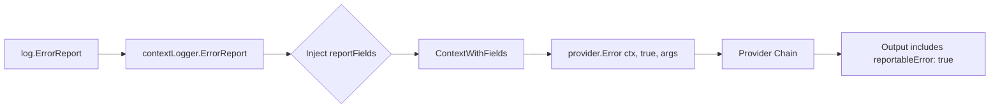

# Implementation Plan: `reportableError` Field Injection

**Version**: 1.7.0 → 1.8.0  
**Date**: 2026-02-16  
**Module**: `github.com/myhelix/contextlogger`

---

## 1. Overview

This document outlines the implementation plan for automatically adding a `"reportableError": true` field to all `*Report` function calls in the contextlogger framework. The goal is to ensure that when any of the following functions are called, the resulting log entry includes this field:

- `ErrorReport()` / `contextLogger.ErrorReport()`
- `WarnReport()` / `contextLogger.WarnReport()`
- `InfoReport()` / `contextLogger.InfoReport()`
- `DebugReport()` / `contextLogger.DebugReport()`

### Dual-Approach Strategy

This implementation uses a **two-phase approach**:

1. **Option B (Primary)**: Inject `"reportableError": true` at the [`log/log.go`](log/log.go) level — zero downstream changes, guaranteed universal adoption
2. **Option A (Secondary/Future)**: New dedicated provider at `providers/reportable/provider.go` — a reusable pattern for future more complex field injection needs

---

## 2. Downstream Impact Comparison

| Aspect | Option B (log/log.go) | Option A (Provider) |
|--------|----------------------|---------------------|
| **Downstream Changes Required** | **None** | Chain reconfiguration |
| **Universal Adoption** | **Guaranteed** | Opt-in required |
| **Complexity** | Simple | Moderate |
| **Extensibility** | Good (via `reportFields` variable) | Excellent (full provider flexibility) |
| **Testability** | Unit tests in `log/` | Isolated provider tests |
| **When to Use** | Simple field injection | Complex/conditional logic |
| **Single Responsibility** | Entry point adds field | Dedicated provider handles field |

### Why Option B is Primary

1. **Zero downstream changes** — No consuming projects need to update their provider chain configuration
2. **Guaranteed universal adoption** — Every `*Report` call automatically includes the field
3. **Simplest path to value** — Minimal code changes, minimal testing surface
4. **Aligns with `report` parameter semantics** — The `report=true` boolean already exists; adding a field that reflects this is a natural extension at the call site

### When Option A Becomes Preferable

Option A (provider pattern) should be used when:
- Field injection logic becomes conditional based on args inspection
- Configuration-driven fields are needed (e.g., feature flags)
- Multiple independent field injection concerns need composition
- Users need to opt-out of the field injection

---

## 3. Phase 1: Option B — Field Injection at `log/log.go` (Primary)

### 3.1 Scope

Modify `*Report` methods in [`log/log.go`](log/log.go) to inject `"reportableError": true` into context before calling the provider chain.

### 3.2 Architecture



### 3.3 Detailed Changes to `log/log.go`

#### 3.3.1 Add Report Fields Constant

Add near the top of the file, after the type definitions:

```go
// reportFields contains fields automatically added to all *Report calls.
// This variable can be extended to add more fields in the future.
var reportFields = Fields{"reportableError": true}
```

#### 3.3.2 Add Helper Function

```go
// contextWithReportFields merges reportFields into the context.
// This is called by all *Report methods to ensure consistent field injection.
func contextWithReportFields(ctx context.Context) context.Context {
    return ContextWithFields(ctx, reportFields)
}
```

#### 3.3.3 Modify contextLogger Methods

Current implementation ([`log/log.go:93-112`](log/log.go:93)):

```go
func (c contextLogger) ErrorReport(args ...interface{}) {
    c.provider.Error(c.Context, true, args...)
}
func (c contextLogger) WarnReport(args ...interface{}) {
    c.provider.Warn(c.Context, true, args...)
}
func (c contextLogger) InfoReport(args ...interface{}) {
    c.provider.Info(c.Context, true, args...)
}
func (c contextLogger) DebugReport(args ...interface{}) {
    c.provider.Debug(c.Context, true, args...)
}
```

**Modified implementation**:

```go
func (c contextLogger) ErrorReport(args ...interface{}) {
    c.provider.Error(contextWithReportFields(c.Context), true, args...)
}
func (c contextLogger) WarnReport(args ...interface{}) {
    c.provider.Warn(contextWithReportFields(c.Context), true, args...)
}
func (c contextLogger) InfoReport(args ...interface{}) {
    c.provider.Info(contextWithReportFields(c.Context), true, args...)
}
func (c contextLogger) DebugReport(args ...interface{}) {
    c.provider.Debug(contextWithReportFields(c.Context), true, args...)
}
```

#### 3.3.4 Package-Level Functions

The package-level functions ([`log/log.go:184-197`](log/log.go:184)) delegate to `BackgroundContext().*Report()`:

```go
func ErrorReport(args ...interface{}) {
    BackgroundContext().ErrorReport(args...)
}
```

**No changes needed** — they automatically get the field injection through `contextLogger.*Report()`.

### 3.4 Test Plan

#### 3.4.1 Positive Tests

**Test**: `*Report` calls include `"reportableError": true` in output

```go
func TestErrorReport_InjectsReportableErrorField(t *testing.T) {
    RegisterTestingT(t)
    
    capturer := structured.LogProvider(nil)
    log.SetDefaultProvider(capturer)
    ctx := context.Background()
    
    log.FromContext(ctx).ErrorReport("test error")
    
    calls := capturer.LogCalls(providers.Error)
    Expect(calls).To(HaveLen(1))
    Expect(calls[0].ContextFields).To(HaveKeyWithValue("reportableError", true))
    Expect(calls[0].Report).To(BeTrue())
}

func TestWarnReport_InjectsReportableErrorField(t *testing.T) {
    // Similar test for WarnReport
}

func TestInfoReport_InjectsReportableErrorField(t *testing.T) {
    // Similar test for InfoReport
}

func TestDebugReport_InjectsReportableErrorField(t *testing.T) {
    // Similar test for DebugReport
}

func TestPackageLevelErrorReport_InjectsReportableErrorField(t *testing.T) {
    RegisterTestingT(t)
    
    capturer := structured.LogProvider(nil)
    log.SetDefaultProvider(capturer)
    
    log.ErrorReport("test error")
    
    calls := capturer.LogCalls(providers.Error)
    Expect(calls).To(HaveLen(1))
    Expect(calls[0].ContextFields).To(HaveKeyWithValue("reportableError", true))
}
```

#### 3.4.2 Negative Tests

**Test**: Non-report calls do NOT include `"reportableError"`

```go
func TestError_DoesNotInjectReportableErrorField(t *testing.T) {
    RegisterTestingT(t)
    
    capturer := structured.LogProvider(nil)
    log.SetDefaultProvider(capturer)
    ctx := context.Background()
    
    log.FromContext(ctx).Error("test error")
    
    calls := capturer.LogCalls(providers.Error)
    Expect(calls).To(HaveLen(1))
    Expect(calls[0].ContextFields).NotTo(HaveKey("reportableError"))
    Expect(calls[0].Report).To(BeFalse())
}

func TestWarn_DoesNotInjectReportableErrorField(t *testing.T) {
    // Similar test for Warn
}

func TestInfo_DoesNotInjectReportableErrorField(t *testing.T) {
    // Similar test for Info
}

func TestDebug_DoesNotInjectReportableErrorField(t *testing.T) {
    // Similar test for Debug
}
```

#### 3.4.3 Integration Tests

**Test**: Works correctly through full provider chain

```go
func TestReportableError_ThroughFullProviderChain(t *testing.T) {
    RegisterTestingT(t)
    
    capturer := structured.LogProvider(nil)
    merryProvider := merry.LogProvider(capturer)
    reportedAtProvider := reported_at.LogProvider(merryProvider, reported_at.RecommendedConfig)
    
    log.SetDefaultProvider(reportedAtProvider)
    
    log.ErrorReport("test error through chain")
    
    calls := capturer.LogCalls(providers.Error)
    Expect(calls).To(HaveLen(1))
    Expect(calls[0].ContextFields).To(HaveKeyWithValue("reportableError", true))
    Expect(calls[0].ContextFields).To(HaveKey("reportedAt"))
}
```

#### 3.4.4 Extensibility Tests

**Test**: Adding a new field to `reportFields` is a one-line change

```go
func TestReportFields_CanBeExtended(t *testing.T) {
    // This is more of a design verification than a runtime test
    // Document that extending reportFields is as simple as:
    // var reportFields = Fields{"reportableError": true, "anotherField": "value"}
}
```

### 3.5 Safety Constraints

| Constraint | Verification |
|------------|--------------|
| Must NOT add `reportableError` to non-report calls | Negative test suite verifies `Error()`, `Warn()`, etc. don't have the field |
| Must NOT break existing provider chain behavior | Integration tests through full chain |
| Must NOT require changes to `LogProvider` interface | Interface remains unchanged in [`providers/providers.go`](providers/providers.go) |
| Must NOT affect `Record` or `RecordEvent` methods | These methods don't have report semantics; no changes made |

---

## 4. Phase 2: Option A — Reusable Provider Pattern (Secondary/Future)

### 4.1 Scope

Create `providers/reportable/provider.go` as a reusable pattern for future complex field injection needs.

### 4.2 When to Use This Pattern

Use the provider pattern when:
- Field injection logic becomes complex (conditional fields)
- Configuration-driven fields are needed
- Fields depend on args inspection
- Users need ability to opt-out
- Multiple independent field injection concerns need composition

### 4.3 File: `providers/reportable/provider.go`

```go
// © 2026 Helix OpCo LLC. All rights reserved.

// Package reportable provides a provider that injects a "reportableError" field
// into log context when the report parameter is true.
//
// This provider follows the established pattern from providers/reported_at and
// serves as a reusable template for future field injection needs.
//
// Usage:
//
//     import "github.com/myhelix/contextlogger/providers/reportable"
//
//     chain := reportable.LogProvider(
//         reported_at.LogProvider(
//             merry.LogProvider(
//                 logrus.LogProvider(...),
//             ),
//             reported_at.RecommendedConfig,
//         ),
//     )
package reportable

import (
    "context"

    "github.com/myhelix/contextlogger/log"
    "github.com/myhelix/contextlogger/providers"
    "github.com/myhelix/contextlogger/providers/chaining"
)

// FieldName is the key used for the reportable error field.
// Exported for consumers who need to reference or check for this field.
const FieldName = "reportableError"

type provider struct {
    providers.LogProvider
}

// LogProvider creates a new reportable provider that wraps the given provider.
// When report=true, it injects {"reportableError": true} into the context.
func LogProvider(nextProvider providers.LogProvider) providers.LogProvider {
    return provider{chaining.LogProvider(nextProvider)}
}

// injectIfReport adds the reportableError field to context if report is true.
func injectIfReport(ctx context.Context, report bool) context.Context {
    if report {
        return log.ContextWithFields(ctx, log.Fields{FieldName: true})
    }
    return ctx
}

func (p provider) Error(ctx context.Context, report bool, args ...interface{}) {
    p.LogProvider.Error(injectIfReport(ctx, report), report, args...)
}

func (p provider) Warn(ctx context.Context, report bool, args ...interface{}) {
    p.LogProvider.Warn(injectIfReport(ctx, report), report, args...)
}

func (p provider) Info(ctx context.Context, report bool, args ...interface{}) {
    p.LogProvider.Info(injectIfReport(ctx, report), report, args...)
}

func (p provider) Debug(ctx context.Context, report bool, args ...interface{}) {
    p.LogProvider.Debug(injectIfReport(ctx, report), report, args...)
}

// Record and RecordEvent inherit from chaining.LogProvider via embedding.
// They do not have the report parameter, so no field injection is applied.
```

### 4.4 File: `providers/reportable/provider_test.go`

```go
package reportable

import (
    "context"
    "testing"

    "github.com/myhelix/contextlogger/log"
    "github.com/myhelix/contextlogger/providers"
    "github.com/myhelix/contextlogger/providers/structured"
    . "github.com/onsi/gomega"
)

func TestReportableError_WhenReportTrue_InjectsField(t *testing.T) {
    RegisterTestingT(t)
    
    capturer := structured.LogProvider(nil)
    testProvider := LogProvider(capturer)
    ctx := context.Background()
    
    testProvider.Error(ctx, true, "test error")
    
    calls := capturer.LogCalls(providers.Error)
    Expect(calls).To(HaveLen(1))
    Expect(calls[0].ContextFields).To(HaveKeyWithValue(FieldName, true))
    Expect(calls[0].Report).To(BeTrue())
}

func TestReportableError_WhenReportFalse_DoesNotInjectField(t *testing.T) {
    RegisterTestingT(t)
    
    capturer := structured.LogProvider(nil)
    testProvider := LogProvider(capturer)
    ctx := context.Background()
    
    testProvider.Error(ctx, false, "test error")
    
    calls := capturer.LogCalls(providers.Error)
    Expect(calls).To(HaveLen(1))
    Expect(calls[0].ContextFields).NotTo(HaveKey(FieldName))
    Expect(calls[0].Report).To(BeFalse())
}

func TestReportableError_AllLevels_WhenReportTrue(t *testing.T) {
    RegisterTestingT(t)
    
    testCases := []struct {
        name     string
        logFunc  func(p providers.LogProvider, ctx context.Context)
        level    providers.LogLevel
    }{
        {"Error", func(p providers.LogProvider, ctx context.Context) { p.Error(ctx, true, "msg") }, providers.Error},
        {"Warn", func(p providers.LogProvider, ctx context.Context) { p.Warn(ctx, true, "msg") }, providers.Warn},
        {"Info", func(p providers.LogProvider, ctx context.Context) { p.Info(ctx, true, "msg") }, providers.Info},
        {"Debug", func(p providers.LogProvider, ctx context.Context) { p.Debug(ctx, true, "msg") }, providers.Debug},
    }
    
    for _, tc := range testCases {
        t.Run(tc.name, func(t *testing.T) {
            capturer := structured.LogProvider(nil)
            testProvider := LogProvider(capturer)
            
            tc.logFunc(testProvider, context.Background())
            
            calls := capturer.LogCalls(tc.level)
            Expect(calls).To(HaveLen(1))
            Expect(calls[0].ContextFields).To(HaveKeyWithValue(FieldName, true))
        })
    }
}

func TestReportableError_PreservesExistingFields(t *testing.T) {
    RegisterTestingT(t)
    
    capturer := structured.LogProvider(nil)
    testProvider := LogProvider(capturer)
    ctx := log.ContextWithFields(context.Background(), log.Fields{"existingKey": "existingValue"})
    
    testProvider.Error(ctx, true, "test error")
    
    calls := capturer.LogCalls(providers.Error)
    Expect(calls).To(HaveLen(1))
    Expect(calls[0].ContextFields).To(HaveKeyWithValue(FieldName, true))
    Expect(calls[0].ContextFields).To(HaveKeyWithValue("existingKey", "existingValue"))
}

func TestReportableError_Record_DoesNotInjectField(t *testing.T) {
    RegisterTestingT(t)
    
    capturer := structured.LogProvider(nil)
    testProvider := LogProvider(capturer)
    ctx := context.Background()
    
    testProvider.Record(ctx, map[string]interface{}{"metric": 1})
    
    calls := capturer.RecordCalls()
    Expect(calls).To(HaveLen(1))
    Expect(calls[0].ContextFields).NotTo(HaveKey(FieldName))
}

func TestFieldName_IsExported(t *testing.T) {
    RegisterTestingT(t)
    Expect(FieldName).To(Equal("reportableError"))
}
```

### 4.5 Note

Phase 2 is **optional for the initial release**. It establishes the pattern for future use when field injection logic becomes more complex than a simple static field.

---

## 5. Version & Changelog

### 5.1 Version Bump

Update [`VERSION`](VERSION) from `1.7.0` to `1.8.0`:

```
1.8.0
```

**Rationale**: Minor version bump because this is a non-breaking feature addition. All existing code continues to work unchanged.

### 5.2 Changelog Entry

Add to [`CHANGELOG.md`](CHANGELOG.md) at the top:

```markdown
## 1.8.0 (2026-02-16)
Features:
- Added automatic `reportableError: true` field injection for all `*Report` function calls (ErrorReport, WarnReport, InfoReport, DebugReport)
- Field is injected at the log/log.go entry point level for guaranteed universal adoption
- Extensible via `reportFields` variable for future field additions
```

> **Note**: The [`VERSION`](VERSION) file currently shows `1.7.0`, but [`CHANGELOG.md`](CHANGELOG.md) only contains entries up to `1.6.2`. This discrepancy should be addressed by adding a minimal `1.7.0` entry (documenting what changed between 1.6.2 and 1.7.0) alongside the new `1.8.0` entry. If no specific changes are known for 1.7.0, consider adding a placeholder entry noting the version bump.

---

## 6. Implementation Task List

| # | Task | File(s) | Phase |
|---|------|---------|-------|
| 1 | Add `reportFields` variable | [`log/log.go`](log/log.go) | 1 |
| 2 | Add `contextWithReportFields()` helper | [`log/log.go`](log/log.go) | 1 |
| 3 | Modify `contextLogger.ErrorReport()` | [`log/log.go`](log/log.go:93) | 1 |
| 4 | Modify `contextLogger.WarnReport()` | [`log/log.go`](log/log.go:99) | 1 |
| 5 | Modify `contextLogger.InfoReport()` | [`log/log.go`](log/log.go:105) | 1 |
| 6 | Modify `contextLogger.DebugReport()` | [`log/log.go`](log/log.go:111) | 1 |
| 7 | Add positive tests for `*Report` methods | `log/log_test.go` (new) | 1 |
| 8 | Add negative tests for non-report methods | `log/log_test.go` | 1 |
| 9 | Add integration test through provider chain | `log/log_test.go` | 1 |
| 10 | (Optional) Create `providers/reportable/provider.go` | `providers/reportable/provider.go` | 2 |
| 11 | (Optional) Create `providers/reportable/provider_test.go` | `providers/reportable/provider_test.go` | 2 |
| 12 | Update VERSION to 1.8.0 | [`VERSION`](VERSION) | 1 |
| 13 | Update CHANGELOG.md | [`CHANGELOG.md`](CHANGELOG.md) | 1 |
| 14 | Run full test suite | `go test ./...` | 1 |
| 15 | Verify no regressions | Manual verification | 1 |

---

## 7. Extensibility Considerations

### 7.1 Adding More Fields in the Future

To add more fields, simply extend the `reportFields` variable:

```go
// Before
var reportFields = Fields{"reportableError": true}

// After (one-line change)
var reportFields = Fields{
    "reportableError": true,
    "newField":        "newValue",
}
```

### 7.2 Graduation Threshold: Option B → Option A

Consider graduating to the provider pattern (Option A) when:

| Trigger | Example |
|---------|---------|
| Conditional logic | "Add field X only if error contains Y" |
| Configuration-driven | "Add field based on environment variable" |
| Args inspection | "Extract error code from first arg" |
| Opt-out requirement | "Some services don't want this field" |
| Composition needs | "Combine with other field injection providers" |

### 7.3 Future Fields

Currently planned: `reportableError: true`

Potential future fields (not part of this implementation):
- Error categorization fields
- Service identification fields
- Environment-specific metadata

---

## 8. Acceptance Criteria

### Phase 1 (Required for v1.8.0)

- [ ] `reportFields` variable exists in [`log/log.go`](log/log.go)
- [ ] `contextWithReportFields()` helper function exists
- [ ] `contextLogger.ErrorReport()` injects `reportableError: true`
- [ ] `contextLogger.WarnReport()` injects `reportableError: true`
- [ ] `contextLogger.InfoReport()` injects `reportableError: true`
- [ ] `contextLogger.DebugReport()` injects `reportableError: true`
- [ ] Package-level `*Report()` functions inherit the field injection
- [ ] Non-report methods (`Error`, `Warn`, `Info`, `Debug`) do NOT have the field
- [ ] `Record` and `RecordEvent` are unaffected
- [ ] All existing tests pass
- [ ] New tests for field injection pass
- [ ] Integration test through provider chain passes
- [ ] `LogProvider` interface is unchanged
- [ ] VERSION is `1.8.0`
- [ ] CHANGELOG.md has entry for 1.8.0

### Phase 2 (Optional/Future)

- [ ] `providers/reportable/provider.go` exists with documented pattern
- [ ] `providers/reportable/provider_test.go` has comprehensive tests
- [ ] Provider follows `reported_at` pattern
- [ ] Provider is chainable via `chaining.LogProvider`

---

## 9. Task Breakdown

See [TASK_BREAKDOWN.md](TASK_BREAKDOWN.md) for the detailed implementation task list.

---

## Appendix A: Code Reference

### Current Provider Interface

From [`providers/providers.go`](providers/providers.go):

```go
type LogProvider interface {
    Error(ctx context.Context, report bool, args ...interface{})
    Warn(ctx context.Context, report bool, args ...interface{})
    Info(ctx context.Context, report bool, args ...interface{})
    Debug(ctx context.Context, report bool, args ...interface{})
    Record(ctx context.Context, metrics map[string]interface{})
    RecordEvent(ctx context.Context, eventName string, metrics map[string]interface{})
    Wait()
}
```

### Field Transport Functions

From [`log/log.go`](log/log.go):

```go
// ContextWithFields merges fields into context
func ContextWithFields(ctx context.Context, fields Fields) context.Context

// FieldsFromContext retrieves fields from context
func FieldsFromContext(ctx context.Context) Fields
```

### Reference Implementation: `reported_at` Provider

The [`providers/reported_at/provider.go`](providers/reported_at/provider.go) serves as the template for the Option A provider pattern:

1. Embeds `providers.LogProvider` from `chaining.LogProvider()`
2. Implements log methods that modify context
3. Passes modified context to embedded provider
4. **DOES override `Record`/`RecordEvent`** to inject the `reportedAt` field into those methods as well (see lines 76-82 in [`providers/reported_at/provider.go`](providers/reported_at/provider.go:76))

> **Important distinction for Option A (`reportable` provider)**: Unlike `reported_at`, the `reportable` provider intentionally does NOT override `Record`/`RecordEvent` because `reportableError` only applies to log-level methods (`Error`, `Warn`, `Info`, `Debug`) where the `report` boolean parameter exists.
